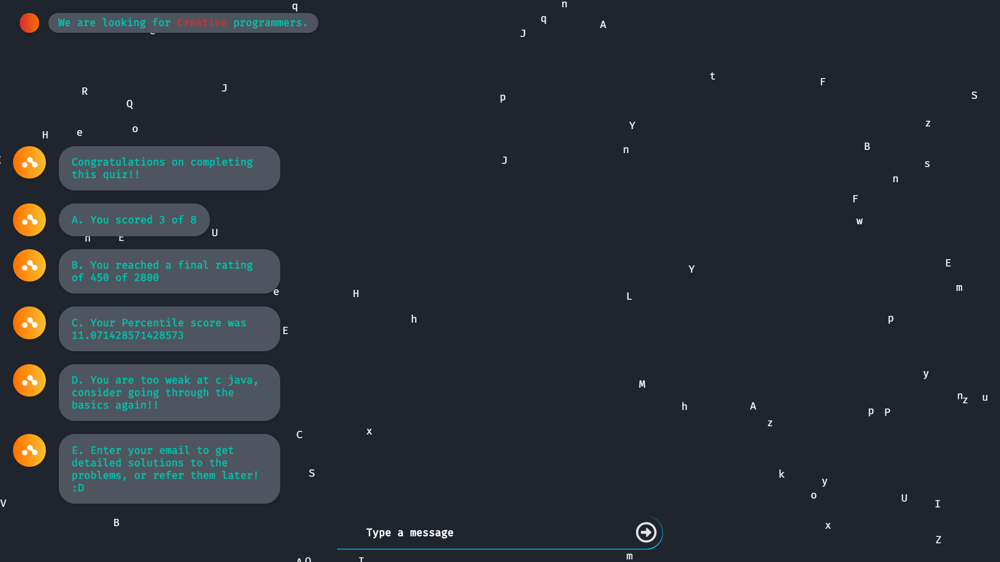

# Chatbot SHELLY 
### Be it JEE, AIIMS, SAT, or GRE, I can help you prepare for it.

# Features :
## - :white_check_mark: Support for JEE, AIIMS, GRE, SAT, Coding preparation
## - :white_check_mark: Easily expandable to include other types of questions
## - :white_check_mark: Automatic keyword detection from english text (can be extended for other languages as well)
## - :white_check_mark: Guided Learning, the bot understands your current level of skill and recommends problems based on your performance
## - :white_check_mark: Report Generation, bot generates a report of users performance after every quiz and Determines weak areas
## - :white_check_mark: Compares you to others who took same test and gives your percentile score
## - :white_check_mark: Provides an option to get quiz along with detailed solutions mailed to your email for referring in future 

## TODO : 
- :white_check_mark: Implement problem class using tags for searching and rating for difficulty
- :white_check_mark: Implement efficient searching for problems with multiple tags 
- :white_check_mark: Extract skills from text entered by user 
- :white_check_mark: Implement algorithm to decide the difficulty of problems according to user performance in 
previous questions 
- :white_check_mark: Implement report generation
- :white_check_mark: Implement frontend 
- :white_check_mark: Integrate everything 
- :white_check_mark: Remove known Bugs
- :white_check_mark: Implement functionality to review problems later (Mailer)
- :clock9: Implement speech to text 
- :clock9: Make chat-bot messages clickable options
- :clock9: Deploy

# Screenshots 
 

 

