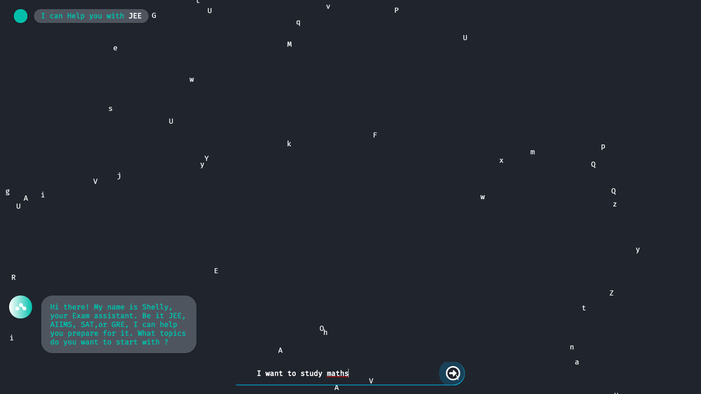
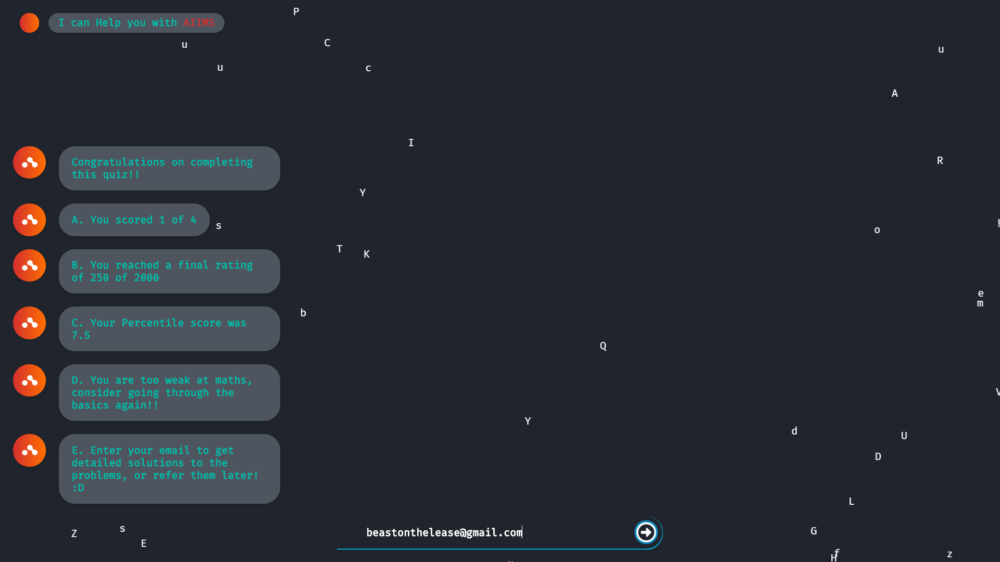
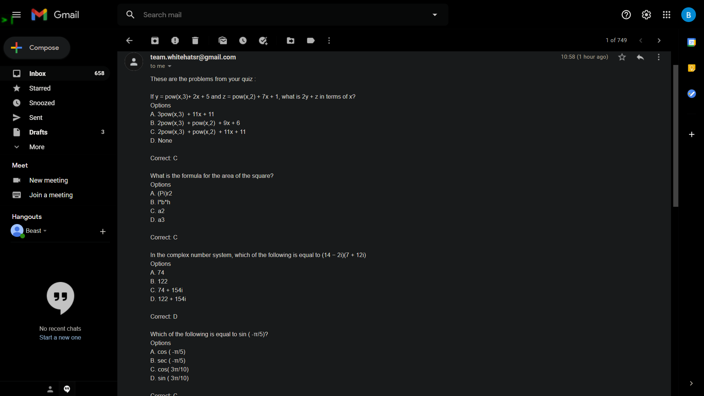

# Chatbot SHELLY 
#### Be it JEE, AIIMS, SAT, or GRE, I can help you prepare for it.

# Features :
##### - :white_check_mark: Support for JEE, AIIMS, GRE, SAT, Coding preparation
##### - :white_check_mark: Easily expandable to include other types of questions
##### - :white_check_mark: Cool UI
##### - :white_check_mark: Automatic keyword detection from english text (can be extended for other languages as well)
##### - :white_check_mark: Guided Learning, bot detects your current level of skill & recommends problems based on your performance
##### - :white_check_mark: Report Generation, bot generates a report of users performance after every quiz and Determines weak areas
##### - :white_check_mark: Compares you to others who took same test and gives your percentile score
##### - :white_check_mark: Provides an option to get quiz along with detailed solutions mailed to your email for referring in future 

# Future scope :
##### - :clock9: Implement speech to text for handicap people
##### - :clock9: Implement text to speech for visually impaired people
##### - :clock9: Implement user account creation and provide an option to save quiz, favourite question
##### - :clock9: Provide a way to directly train weak areas, acc to the data from prev quizzes attempted by user
##### - :clock9: Implement an option to add friends and solve questions that friends have solved
##### - :clock9: Implement support for Non MCQ problems

# Screenshots :

-Automatic keyword extraction from text
 

- Recommends problems based on your performance
 

- Generates report of the quiz and identifies strong/weak areas
 

- Mails you the quiz with solutions for future referrence
 

